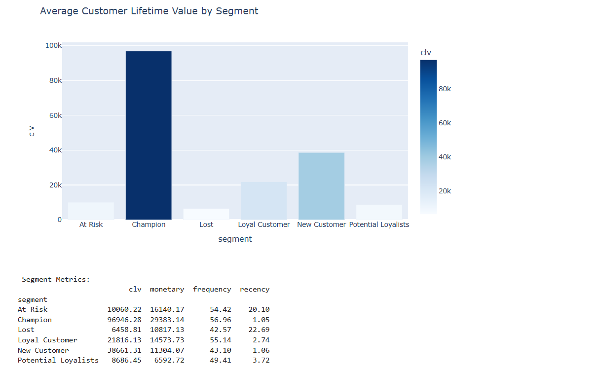
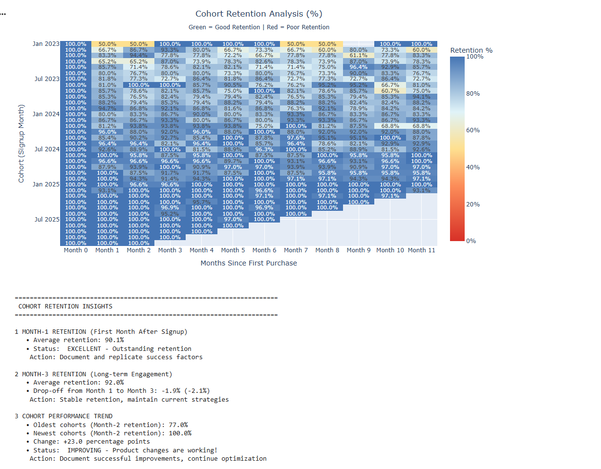

# Fintech Customer Analytics Dashboard

[](https://colab.research.google.com/github/tanwar98anupama/fintech-customer-analytics/blob/main/fintech_customer_analytics.ipynb)

A comprehensive customer analytics system for fintech companies using Python. This project analyzes transaction patterns, segments customers, predicts churn, and calculates lifetime value to drive data-driven business decisions.

##  Project Overview

This project demonstrates key business analyst skills for the fintech industry:
- **RFM Analysis** - Segment customers by Recency, Frequency, and Monetary value
- **Customer Segmentation** - Identify Champions, At-Risk, and Lost customers
- **CLV Calculation** - Predict customer lifetime value over 12 months
- **Churn Prediction** - Identify customers at risk of leaving
- **Cohort Analysis** - Track retention rates over time

##  Key Insights

From analyzing 1,000 customers and 50,000+ transactions:

- **Customer Segmentation**: Identified 6 distinct customer segments including Champions (15%) and At-Risk customers (10%)
- **Revenue Concentration**: Top 20% of customers generate 60%+ of revenue
- **Churn Risk**: Detected high-value customers at risk, representing significant potential revenue loss
- **Retention Patterns**: Month-3 retention analysis reveals critical onboarding period

##  Technologies Used

- **Python** - Core programming language
- **Pandas** - Data manipulation and analysis
- **NumPy** - Numerical computations
- **Plotly** - Interactive data visualizations
- **Faker** - Synthetic data generation

##  Business Applications

This analysis enables:
- **Targeted Marketing**: Customized campaigns for each customer segment
- **Retention Strategy**: Win-back campaigns for At-Risk high-value customers
- **Resource Allocation**: Focus efforts on high-CLV customers
- **Product Development**: Identify and fix onboarding issues based on cohort drop-offs
- **Revenue Forecasting**: Project future revenue based on CLV calculations

##  Sample Visualizations

### Customer Segmentation Distribution


### Customer Lifetime Value by Segment


### Cohort Retention Heatmap


##  How to Run

### Option 1: Google Colab (Recommended for Beginners)
1. Click on the `.ipynb` file above
2. Click "Open in Colab" badge
3. Run all cells in order (Cell > Run All)

### Option 2: Local Environment
```bash
# Install required packages
pip install pandas numpy plotly faker

# Open Jupyter Notebook
jupyter notebook fintech_customer_analytics.ipynb
```

##  Project Structure
```
fintech-customer-analytics/
│
├── fintech_customer_analytics.ipynb    # Main analysis notebook
└── README.md                            # Project documentation
```

##  Key Learnings

### Technical Skills
- Data manipulation with pandas (groupby, merge, pivot)
- Statistical analysis (percentiles, aggregations)
- Data visualization with Plotly
- Working with datetime data

### Business Skills
- Understanding customer behavior patterns
- Translating data into actionable insights
- Creating business-focused metrics (RFM, CLV, retention)
- Presenting findings for stakeholder decision-making

##  Future Enhancements

Potential improvements:
- [ ] Add machine learning for churn prediction
- [ ] Build interactive Streamlit dashboard
- [ ] Integrate real transaction data via API
- [ ] Add A/B test simulation framework
- [ ] Create automated reporting system

##  About Me

I'm a data analyst specializing in fintech analytics with a focus on customer behavior and business intelligence. This project demonstrates my ability to:
- Transform raw transaction data into actionable insights
- Build customer segmentation frameworks
- Calculate and interpret key business metrics
- Present complex analyses in clear, business-friendly terms

##  Contact

- **LinkedIn**: [linkedin.com/in/anupama-rathod](https://www.linkedin.com/in/anupama-rathod/)
- **Email**: tanwar98anupama@gmail.com
- **Portfolio**: https://github.com/tanwar98anupama

---

⭐ If you found this project helpful, please give it a star!
